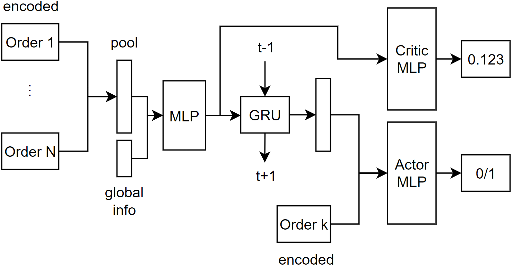

# learn-to-select
> This code for the [EURO Meets NeurIPS 2022 Vehicle Routing Competition](https://euro-neurips-vrp-2022.challenges.ortec.com/) is released under the GPLv3 license.

We use the hybrid genetic search (HGS) solver for the static problem, and train an RL model to learn to select which order to dispatch for the dynamic variant.

The main file is `solver.py` and the RL model is in `strategies/_ppo.py`.

The overall architecture for the RL model is shown above. To calculate the state representation, the features of the orders are first encoded into 64-dimentional vectors by a MLP module, then pooled using max pooling and average pooling, concatenated with the global info features, encoded with another MLP module, and finally go through the GRU module. The critic module is an MLP that takes the state representation as input and outputs state value estimation. The action module is an MLP that for each order takes the state representation and the encoded vector of that order as input and outputs the probability of whether to dispatch this order or not.